<section class="banner">
	

		

			<h1 class="page-title">Nos références</h1>
		

	

</section>

<section class="section section-alt">
	

		

			

			

			

				<article data-order="1" class="reference block block-odd">
					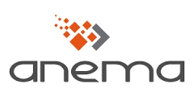
					<h2 class="reference-title">Anema : 
						Consulting POC AngularJS à distance.</h2>
				</article>

				<article data-order="2" class="reference block block-even">
					
					
					<h2 class="reference-title">Anovéo 
						Anoloc : Application Web de géolocatisation et monitoring temps réel de flottes de véhicules. Développement AngularJS.</h2>
				</article>

				<article data-order="3" class="reference block block-odd">
					
					<h2 class="reference-title">Centile Télécom Applications 
						MyReports : Application Web de consultation immédiate et planification d'envoi par emails de rapports de statistiques métier. Développement AngularJS.</h2>
				</article>

				<article data-order="4" class="reference block block-even">
					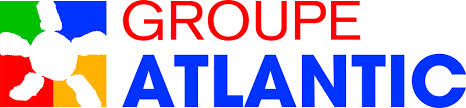
					<h2 class="reference-title">Group Atlantic 
						Doc GA : Application Web de gestion documentaire. Développement Node.js.</h2>
				</article>

				<article data-order="5" class="reference block block-odd">
					
					<h2 class="reference-title">Clever Institut 
						Formations AngularJS, Node.js, React, JavaScript en intra et inter-entreprises, niveau standard ou avancé.</h2>
					

					<button class="reference-btn">+</button>
				</article>

				<article data-order="6" class="reference block block-even">
					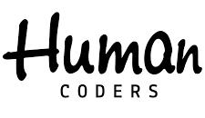
					<h2 class="reference-title">Human Coders 
						Formations et Consulting AngularJS, Node.js, JavaScript en intra et inter-entreprises.</h2>
				</article>

				<article data-order="7" class="reference block block-odd">
					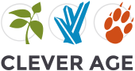
					<h2 class="reference-title">Clever Age 
						Consulting POC React à architecture isomorphe.</h2>
				</article>

				<article data-order="8" class="reference block block-even">
					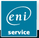
					<h2 class="reference-title">ENI Service 
						Formations AngularJS, Node.js, JavaScript en intra et inter-entreprises.</h2>
				</article>

				<article data-order="9" class="reference block block-odd">
					
					<h2 class="reference-title">Évolution Multimedia 
						Formation AngularJS avancé.</h2>
				</article>

				<article data-order="10" class="reference block block-even">
					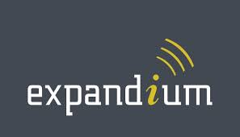
					<h2 class="reference-title">Expandium 
						CallTrace RT : Application Web de monitoring et cartographie temps réel de télétransmissions ferroviaires. Consulting , BootCamp et Développement AngularJS.</h2>
				</article>

				<article data-order="11" class="reference block block-odd">
					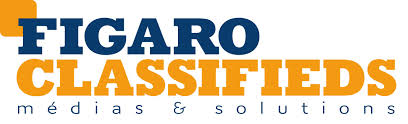
					<h2 class="reference-title">Figaro Classifieds 
						Immobox : Application Web de gestion d'annonces immobilières. Consulting , Formation et Développement AngularJS. 
						Immovision Full Web : Application Web de gestion d'agences immobilières. Consulting et Développement AngularJS.</h2>
				</article>

				<article data-order="12" class="reference block block-even">
					
					<h2 class="reference-title">I-novatic 
						Optimiz.me : Application web de gestion SEO autonome pour TPE. Développement AngularJS.</h2>
				</article>

				<article data-order="13" class="reference block block-odd">
					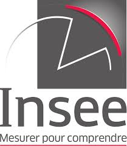
					<h2 class="reference-title">Insee 
						Rorcal: Application Web de saisie de données statistiques. Formation et BootCamp AngularJS.</h2>
				</article>

				<article data-order="14" class="reference block block-even">
					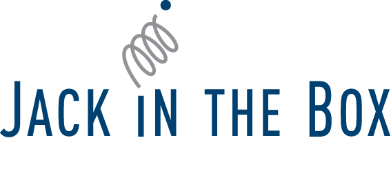
					<h2 class="reference-title">Jack In The Box 
						BootCamp AngularJS.</h2>
				</article>

				<article data-order="15" class="reference block block-odd">
					
					<h2 class="reference-title">Native Communication 
						Auvergne New Deal : Mur social à affichage temps réel. Consultinhg et Développement AngularJS.</h2>
				</article>

				<article data-order="16" class="reference block block-even">
					
					<h2 class="reference-title">Net Direct 
						Ruche V2 : Application Web de gestion et d'échanges en temps réel pour conférencing participatif. Consulting et Développement Node.js.</h2>
				</article>

				<article data-order="17" class="reference block block-odd">
					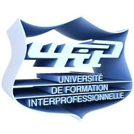
					<h2 class="reference-title">Ufip 
						Formation et Consulting à distance AngularJS.</h2>
				</article>

				<article data-order="18" class="reference block block-even">
					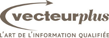
					<h2 class="reference-title">Vecteur Plus 
						Formation Node.js.</h2>
				</article>

				<article data-order="19" class="reference block block-odd">
					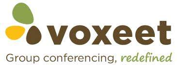
					<h2 class="reference-title">Voxeet 
						Voxeet Web : Application Web de group conferencing 3D-HD. Développement AngularJS.</h2>
				</article>

				<article data-order="20" class="reference block block-even">
					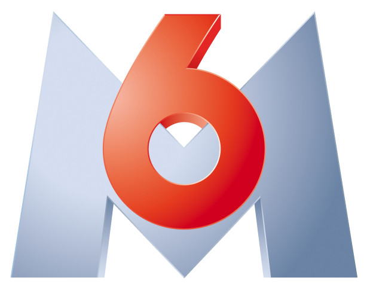
					<h2 class="reference-title">M6 Web 
						Consulting POC Node.js à architecture isomorphe.</h2>
				</article>

				<article data-order="21" class="reference block block-odd">
					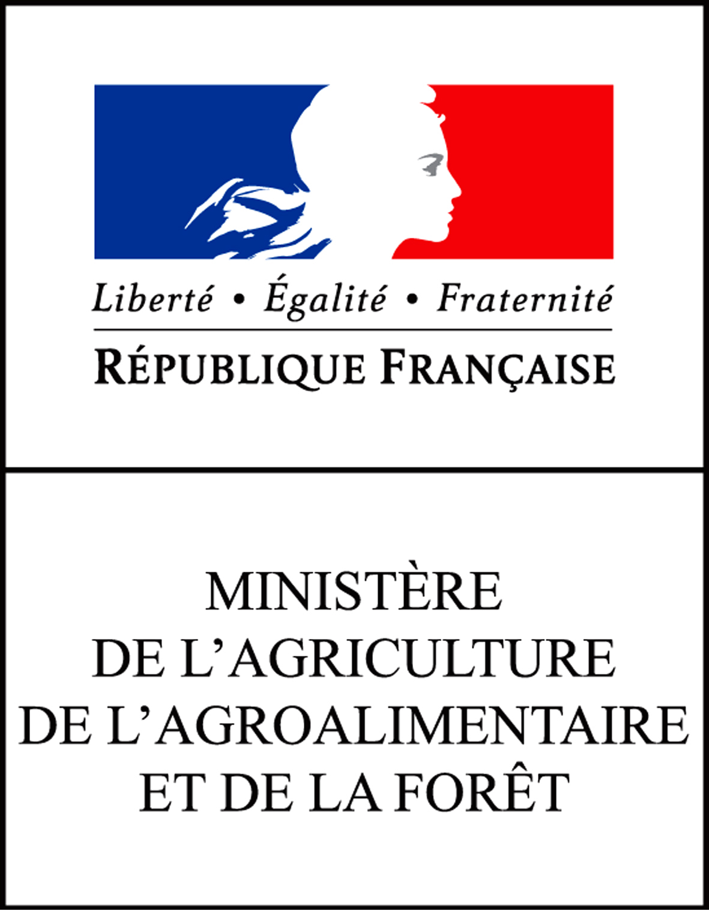
					<h2 class="reference-title">DRAAF 
						Consulting et Développement sous Node.js d'un service de Web Scraping de données d'un intranet.</h2>
				</article>

			

		

	

</section>
