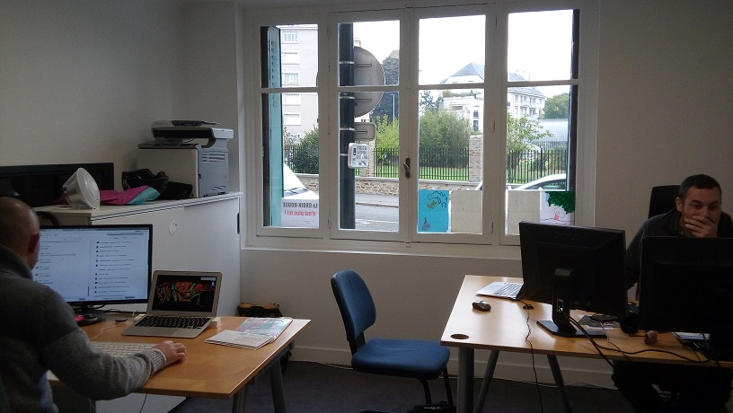

<section>

	

		

			

				<nav class="robin-nav">
					<ul>
						<li><a href="#presentation">Présentation</a></li>
						<li><a href="#lundi">Lundi</a></li>
						<li><a href="#mardi">Mardi</a></li>
						<li><a href="#mercredi">Mercredi</a></li>
						<li><a href="#jeudi">Jeudi</a></li>
						<li><a href="#vendredi">Vendredi</a></li>
						<li><a href="#soundbox">Soundbox</a></li>
					</ul>
				</nav>

				<h2>Bonjour, je suis Robin.</h2>

				
Je suis en stage de 3eme au .

				
Voici le compte rendu de ma semaine passée dans cette société.

			

			

				<h2>Présentation de la société</h2>

				<h3>Son histoire</h3>
				
L'entreprise s'est formée le 13 février 2013. Au depart elle s'appelait LMTM (Lilian Martineau, Thomas Moyse) mais elle à décidé par la suite de se faire appeler ByteClub.

				<h3>Ses activités</h3>
				
L'entreprise :

				<ul>
					<li> Développe des applications. </li>
					<li> Propose des formation JavaScript de remise à niveau ainsi qu'une formation ECMAScript. </li>
					<li> Edite des logiciels. </li>
				
				<h3>Son organisation</h3>
				
C'est une petite entreprise (4 personnes y travaillent).
				Ils ont tous un poste différent.

				<h3>Les bureaux</h3>
				
Le bureau se trouve à Nantes  (Place Sophie Trebuchet) ,
				mais deux des quatres personnes travaillent depuis chez eux , à Lyon

				

				<h3>Les gens</h3>
				
Thomas Moyse : Expert AngularJS, développeur, formateur.

				
Lilian Martineau : Gestionnaire, commercial.

				
Nicolas Chambrier : Expert Node.js, développeur, formateur.

				
Bruno Heridet : Expert AngularJS et Node.js, développeur, formateur.

			

			

				<h2>Lundi</h2>

				
Je me suis familliarisé avec les outils principaux d'un developpeur. J'ai installé un environnement de travail. Ma mission pour la semaine est de modifier le site internet de l'entreprise (onglet techno angular2) et de créer une page cachée parlant de mon stage . Pour cela je vais avoir besoin d'utiliser des logiciels de développement.

				<h3>1. Inscription à GitHub</h3>
				
Mon comte : https://github.com/robinmabit

				<h3>2. Installation de GitGub</h3>
				
GitHub est un site où n'importe qui peut créer et présenter sont travail. 

				<h3>3. Installation de NodeJS et de npm</h3>
				
NodeJS et npm sont des outils du développeur.

				<h3>4. Installation de Sulime Text 3</h3>
				
Sublime Text est un éditeur de texte pour modifier les sources d'une application.

		
			
			

			

				<h2>Mardi</h2>

				
J'ai commencé la page cachée de mon stage sur le site de l'entreprise. Ajout de la rubrique Angular dans la page "Nos Technologie". Inversion du logo Angular pour le logo AngularJS.

			

			

				<h2>Mercredi</h2>

				
Continuation de ma page cachée.

			

			

				<h2>Jeudi</h2>

				
Ajout de la rubrique Angular dans la page "Nos Services" du site de l'entreprise. Changement du logo Angular sur la page formations-angularjs.

			

			

				<h2>Vendredi</h2>

				
Finition de ma page cachée. Ajout du texte dans la rubrique Formation Angular sur le site de l'entreprise.

			

			
			

				<h2>SoundBox</h2>
				<table class="robin-sound">
					<tr>
						<td><button onclick="parle('sf_pet_13')">prout</button></td>			
						<td><button onclick="parle('sf_laser_15')">laser</button></td>
						<td><button onclick="parle('madgiggle')">ricanement</button></td>
					</tr>
					<tr>
						<td><button onclick="parle('Rire du Diable')">Rire du Diable</button></td>	 <td><button onclick="parle('Monstre')">Monstre</button></td>
						<td><button onclick="parle('Porte qui grince')">Porte qui grince</button></td>
					</tr>
				</table>
			

		

	

</section>

